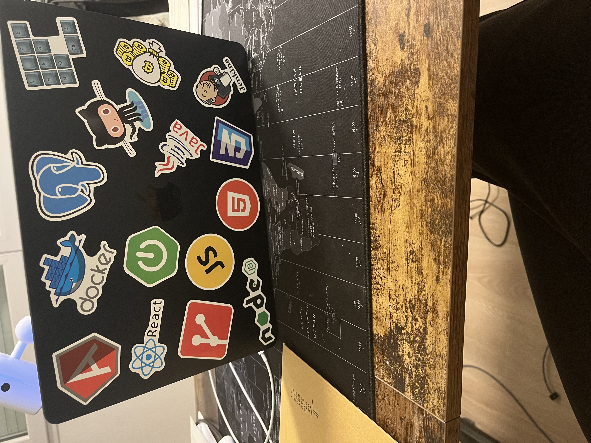

# 👋 Hello, I'm Rouchdane!

🎯 Fullstack Developer | 🌐 Passionate about Web Development | 🚀 Open Source Enthusiast

## About Me
I am a **Fullstack Developer** with a strong foundation in building responsive and scalable web applications. I enjoy working on both **front-end** and **back-end** projects, transforming ideas into reality with clean, efficient, and reusable code.

- 🔭 Currently working on: my portfolio
- 🌱 Learning: React
- 💬 Ask me about: TypeScript, Angular, Node.js, Java, Spring boot, CI/CD, AWS

## 🛠️ Tech Stack
- **Front-end:** HTML, CSS, TypeScript, React, Angular, CSS
- **Back-end:** Nestjs, NodeJs, Spring boot, Java
- **Databases:** PostgreSQL, MongoDB
- **DevOps & Tools:** Docker, Git, GitHub Actions, AWS
- **Other Skills:** REST APIs, Azure

## 💼 Portfolio
Check out my work at: guess_logic_number

📫 **Let's connect!**
- LinkedIn: https://www.linkedin.com/in/rouchdane-moudjibou/
- Email: [moudjibourouchdan80@gmail.com](moudjibourouchdan80@gmail.com)

🌟 Feel free reaching out for collaboration!

